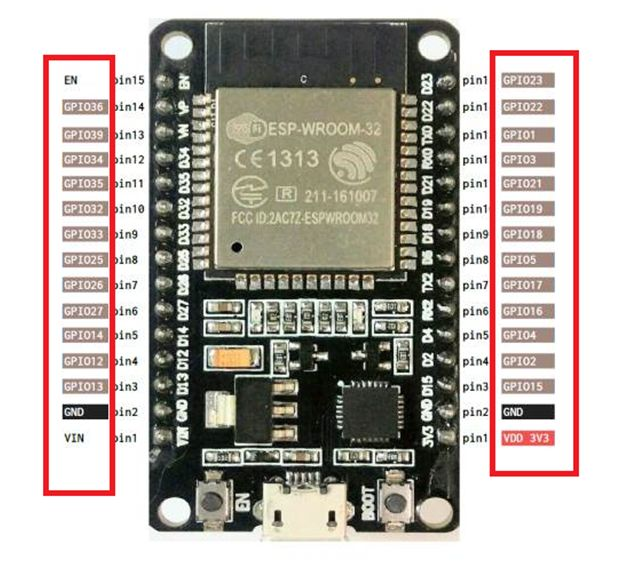
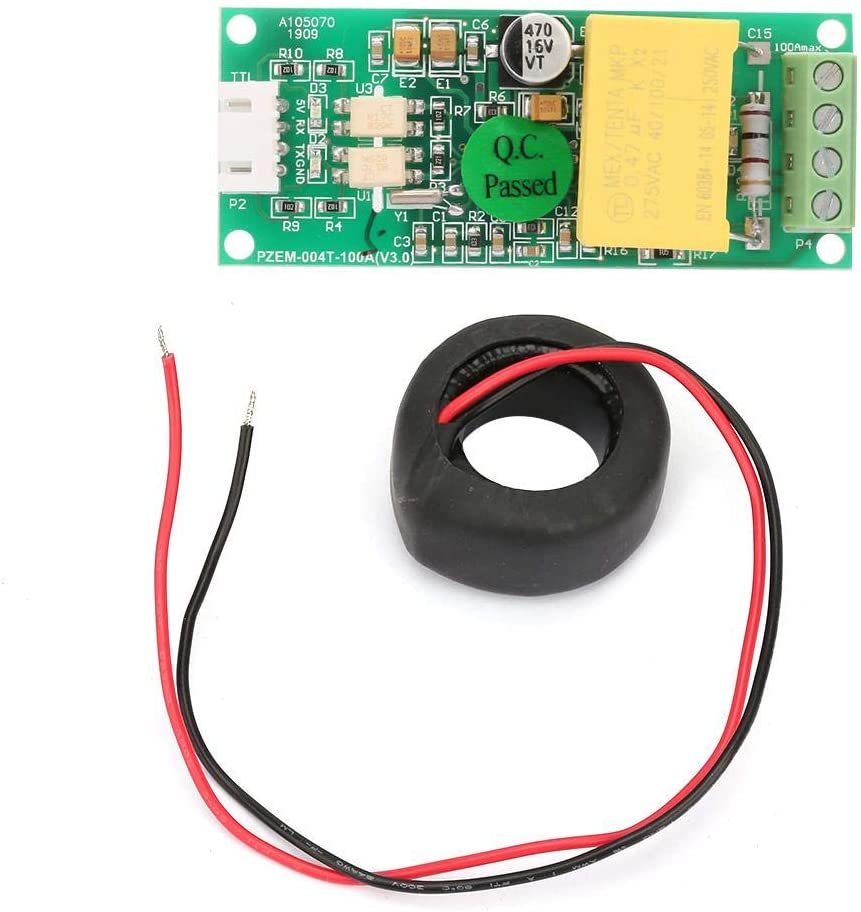
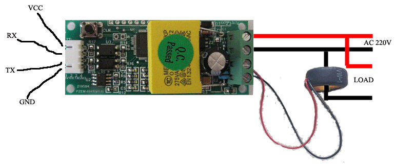
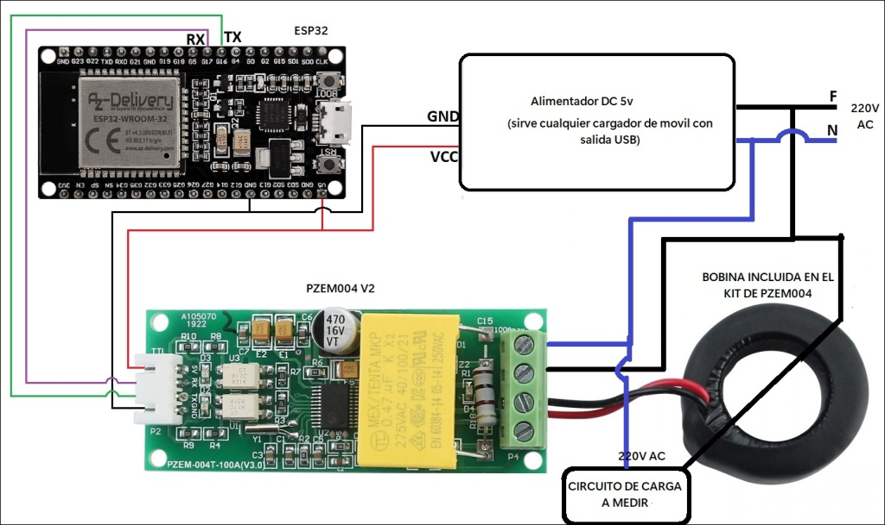
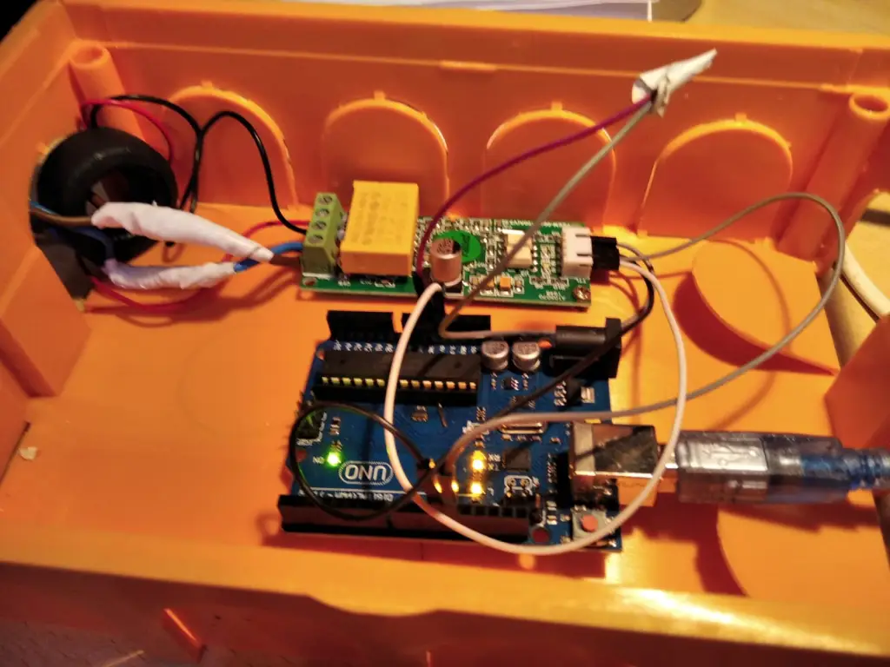

*Montaje de prueba  datalogger para PZEM004

El [Pzem004](https://amzn.to/3Ea4Vcw) es un módulo de prueba de monitorización eléctrica que incluye un transformador de corriente que viene además ya calibrado. El módulo puede usarse para medir la energía, el voltaje y la corriente, y luego mostrarlo en un PC u otros terminales ofreciendo una precisión del 1%.

En la versión con Display incluye un botón de restablecimiento que puede restablecer los datos de energía simplemente pulsándolo. Además, puede almacenar datos cuando se apaga, y almacenar los datos de energía acumulados antes de apagarse, por lo que es muy conveniente usarlo.

Gracias a que todas las versiones equipan un interfaz de comunicación de datos serie TTL, puede leer y configurar los parámetros relevantes a través del puerto serie que podemos capturar con un microcontrolador como por ejemplo un ESP32.

En efecto usando la Biblioteca Arduino para Peacefair en un ESP32 y un [**PZEM-004T-100A v3.0**](https://amzn.to/3Ea4Vcw) podemos **construir un Monitor de energía** usando la interfaz ModBUS.

Antes de empezar debemos saber que la versión 3.0 PZEM es una versión mejorada de la anterior PZEM-004T (para la que puede encontrar la biblioteca [aquí](https://github-com/olehs/PZEM004T?_x_tr_sl=en&_x_tr_tl=es&_x_tr_hl=es&_x_tr_pto=wapp) aunque las bibliotecas son incompatibles entre las dos versiones de hardware).

Las principales características de este módulo son las siguientes;

-   Mide voltaje, corriente, potencia, energía, **factor** de potencia y **frecuencia** (nuevo en la versión 3.0)
-   247 direcciones esclavas programables únicas
    -   Permite que múltiples esclavos usen la misma interfaz serial [PZEM MulitDevice Demo](https://github-com.translate.goog/mandulaj/PZEM-004T-v30/blob/master/examples/PZEMMultiDevice/PZEMMultiDevice.ino?_x_tr_sl=en&_x_tr_tl=es&_x_tr_hl=es&_x_tr_pto=wapp)
-   Contador de energía interna hasta 9999.99kWh
-   Alarma de sobrealimentación
-   Puesta a cero del contador de energía
-   Suma de comprobación CRC16
-   Mejor, pero no perfecto aislamiento de red

Especificaciones del fabricante

| **FUNCIÓN**        | **RANGO DE MEDICIÓN** | **RESOLUCIÓN**  | **PRECISIÓN** |
|--------------------|-----------------------|-----------------|---------------|
| Voltaje            | 80\~260V              | 0.1V            | 0,5%          |
| Actual             | 0\~10A o 0\~100A\*    | 0.01A o 0.02A\* | 0,5%          |
| Poder activo       | 0\~2,3kW o 0\~23kW\*  | 0.1W            | 0,5%          |
| energía activa     | 0\~9999.99kWh         | 1Wh             | 0,5%          |
| Frecuencia         | 45\~65Hz              | 0,1 Hz          | 0,5%          |
| Factor de potencia | 0,00\~1,00            | 0.01            | 1%            |

\* Uso del transformador de corriente externo en lugar del derivador incorporado

este módulo es una versión mejorada del PZEM-004T con funciones de medición de frecuencia y factor de potencia, disponible en los lugares habituales. Se comunica mediante una interfaz TTL a través de un protocolo de comunicación similar a Modbus-RTU, pero es incompatible con la biblioteca @olehs anterior que se encuentra aquí: <https://github.com/olehs/PZEM004T&nbsp>;.

Compatibilidad con Arduino

A continuación, mostramos la compatibilidad con diferentes microcontroladores:

| **UCM**                    | **SERIE DE HARDWARE** | **SERIE DE SOFTWARE** | **NO PROBADO** | **EJEMPLOS**                                                                                                                                                                                                                                                                                                                                                                      | **NOTAS**                                                                                                                      |
|----------------------------|-----------------------|-----------------------|----------------|-----------------------------------------------------------------------------------------------------------------------------------------------------------------------------------------------------------------------------------------------------------------------------------------------------------------------------------------------------------------------------------|--------------------------------------------------------------------------------------------------------------------------------|
| ATmega168                  |                       |                       | X              | [Hardware Serie](https://github-com.translate.goog/mandulaj/PZEM-004T-v30/blob/master/examples/PZEMHardSerial/PZEMHardSerial.ino?_x_tr_sl=en&_x_tr_tl=es&_x_tr_hl=es&_x_tr_pto=wapp) [Software Serie](https://github-com.translate.goog/mandulaj/PZEM-004T-v30/blob/master/examples/PZEMSoftwareSerial/PZEMSoftwareSerial.ino?_x_tr_sl=en&_x_tr_tl=es&_x_tr_hl=es&_x_tr_pto=wapp) |                                                                                                                                |
| ATmega328 ( Arduino Uno)   | ( )                   |                       |                | [Hardware Serie](https://github-com.translate.goog/mandulaj/PZEM-004T-v30/blob/master/examples/PZEMHardSerial/PZEMHardSerial.ino?_x_tr_sl=en&_x_tr_tl=es&_x_tr_hl=es&_x_tr_pto=wapp) [Software Serie](https://github-com.translate.goog/mandulaj/PZEM-004T-v30/blob/master/examples/PZEMSoftwareSerial/PZEMSoftwareSerial.ino?_x_tr_sl=en&_x_tr_tl=es&_x_tr_hl=es&_x_tr_pto=wapp) | HW Serial entra en conflicto con la salida de depuración. Sin embargo, se puede usar sin tener ninguna salida de consola serie |
| ATmega2560 ( Arduino Mega​​) |                       |                       |                | [Hardware Serie](https://github-com.translate.goog/mandulaj/PZEM-004T-v30/blob/master/examples/PZEMHardSerial/PZEMHardSerial.ino?_x_tr_sl=en&_x_tr_tl=es&_x_tr_hl=es&_x_tr_pto=wapp) [Software Serie](https://github-com.translate.goog/mandulaj/PZEM-004T-v30/blob/master/examples/PZEMSoftwareSerial/PZEMSoftwareSerial.ino?_x_tr_sl=en&_x_tr_tl=es&_x_tr_hl=es&_x_tr_pto=wapp) |                                                                                                                                |
| ESP8266                    | ( )                   |                       |                | [SoftwareSerial](https://github-com.translate.goog/mandulaj/PZEM-004T-v30/blob/master/examples/PZEMSoftwareSerial/PZEMSoftwareSerial.ino?_x_tr_sl=en&_x_tr_tl=es&_x_tr_hl=es&_x_tr_pto=wapp)                                                                                                                                                                                      | HW Serial entra en conflicto con la salida de depuración Serial                                                                |
| ESP32                      |                       |                       |                | [HardwareSerie](https://github-com.translate.goog/mandulaj/PZEM-004T-v30/blob/master/examples/PZEMHardSerial/PZEMHardSerial.ino?_x_tr_sl=en&_x_tr_tl=es&_x_tr_hl=es&_x_tr_pto=wapp)                                                                                                                                                                                               | SW Serial no es realmente necesario ya que ESP32 tiene 3 seriales HW con pines configurables                                   |
| STM32                      |                       |                       | X              |                                                                                                                                                                                                                                                                                                                                                                                   |                                                                                                                                |

**Comunicación en serie**

[Este módulo](https://amzn.to/3Ea4Vcw) está equipado con una interfaz de comunicación de datos en serie TTL, puede leer y configurar los parámetros relevantes a través del puerto en serie; pero si desea comunicarse con un dispositivo que use USB o RS232 (como un ordenador), debe estar equipado con un adaptador TTL diferente (la comunicación USB debe estar equipada con una placa adaptadora de conexiones TTL a USB y la comunicación RS232 debe estar equipada con un adaptador TTL a niveles RS232)

En la siguiente tabla se encuentran los protocolos de comunicación de este módulo:

| **NO** | **FUNCIÓN**                                     | **CABEZA** | **DATOS1- DATOS5**                                                                                            | **SUMA** |
|--------|-------------------------------------------------|------------|---------------------------------------------------------------------------------------------------------------|----------|
| 1a     | Requerimiento de voltaje                        | B0         | C0 A8 01 01 00 (La computadora envía una solicitud para leer el valor del voltaje)                            | 1A       |
| 1b     | Respuesta de voltaje                            | A0         | 00 E6 02 00 00 (Respuesta del medidor, el valor del voltaje es 230,2 V)                                       | 88       |
| 2a     | Requerimiento actual                            | B1         | C0 A8 01 01 00 (La computadora envía una solicitud para leer el valor actual)                                 | 1B       |
| 2b     | Representante actual                            | A1         | 00 11 20 00 00 (Respuesta del medidor, el valor actual es 17.32A)                                             | D2       |
| 3a     | Requerimiento de potencia activa                | B2         | C0 A8 01 01 00 (La computadora envía una solicitud para leer el valor de potencia activa)                     | 1C       |
| 3b     | Potencia activa Resp.                           | A2         | 08 98 00 00 00 (Respuesta del medidor, el valor de potencia activa es 2200w)                                  | 42       |
| 4a     | Leer energía Req                                | B3         | C0 A8 01 01 00 (La computadora envía una solicitud para leer el valor de energía)                             | 1D       |
| 4b     | Leer energía Resp.                              | A3         | 01 86 9f 00 00 (Respuesta del medidor, el valor de energía es 99999wh)                                        | C9       |
| 5a     | Establecer la dirección del módulo Req          | B4         | C0 A8 01 01 00 (La computadora envía una solicitud para configurar la dirección, la dirección es 192.168.1.1) | 1E       |
| 5b     | Establecer la dirección del módulo resp.        | A4         | 00 00 00 00 00 (Respuesta del medidor, la dirección se estableció correctamente)                              | A4       |
| 6a     | Establecer el umbral de alarma de potencia Req  | B5         | C0 A8 01 01 14 (la computadora envía una solicitud para establecer un umbral de alarma de energía)            | 33       |
| 6b     | Establecer el umbral de alarma de potencia Resp | A5         | 00 00 00 00 00 (El medidor responde que el umbral de alarma de energía se configuró correctamente)            | A5       |

Veamos ahora un ejemplo de protocolo de comunicación:

**1-Configure la dirección de comunicación**: 192.168.1.1 (el usuario puede configurar su propia dirección en función de sus preferencias y necesidades).

**Enviar comando: B4 C0 A8 01 01 00 1E –\>Datos de respuesta: A4 00 00 00 00 00 A4 .**

Nota: El envío de comandos y la respuesta automática de datos son como se muestra arriba, los datos se expresan en hexadecimal; el último byte de los datos de envío y respuesta son 1E y A4, pertenecen a la suma acumulativa. En el envío de comandos: B4 + C0 + A8 + 01 + 01 + 00 = 21E (utilice la suma hexadecimal), los datos de suma acumulada son 21E, tome los dos últimos bytes 1E para utilizar los datos de suma acumulada en el envío de comandos; datos en respuesta: A4 + 00 + 00 + 00 + 00 + 00 = A4 (use la suma hexadecimal), la suma acumulada de datos es A4, que es la suma acumulada de datos en respuesta.

**2-Configure el umbral de alarma de potencia: 20 KW**  
**Comando de envío: B5 C0 A8 01 01 14 33–\>Datos de respuesta: A5 00 00 00 00 00 A5**  
Nota : 14 en el comando de envío es el valor de la alarma (14 es una representación de datos hexadecimales, que se convirtió a decimal es 20). Lo que debe tener en cuenta es que el valor de alarma de potencia de este módulo se basa en unidades KW, lo que significa que el valor mínimo de alarma es 1 KW, el valor máximo es 22 KW.

**3-Leer el voltaje actual**  
**Enviar comando: B0 C0 A8 01 01 00 1A–\>Datos de respuesta: A0 00 E6 02 00 00 88**  
Nota : Los datos de voltaje de respuesta son D1D2D3 = 00 E6 02, 00 E6 representa el bit entero del voltaje, 02 representa el decimal del voltaje, el decimal es un dígito, convierte 00 E6 en decimal es 230; convierte 02 a decimal es 2, por lo que el valor de voltaje actual es 230.2V.

**4-Leer el comando de envío actual actual**

**Enviar comando: B1 C0 A8 01 01 00 1B–\>Datos de respuesta: A1 00 11 20 00 00 D2**  
Nota : Los datos actuales de respuesta son D2D3 = 11 20, 11 representan el bit entero de la corriente, 20 representan el decimal del actual, el decimal actual es de dos dígitos, convierte 11 en decimal es 17; convierte 20 a decimal es 32, por lo que el valor actual actual es 17,32 A.

**5-Leer el comando de envío de energía actual**

**Enviar comando:: B2 C0 A8 01 01 00 1C–\>Datos de respuesta: A2 08 98 00 00 00 42**  
Nota : Los datos de energía de respuesta son D1D2 = 08 98, convierte 08 98 a decimal es 2200, por lo que el valor de voltaje actual es 2200W .

**6-Leer el comando de envío de energía:**

**Enviar comando: B3 C0 A8 01 01 00 1D–\>Datos de respuesta: A3 01 86 9F 00 00 C9**  
Nota: los datos de energía de respuesta son D1D2D3 = 01 86 9F, convierte 01 86 9F a decimal es 99999, por lo que la energía acumulada es 99999Wh.

Circuito Básico con ejemplo de código

Gracias a la biblioteca PZEM-004T v3.0 para el monitor de **energía** Peacefair **PZEM-004T-10A** y [**PZEM-004T-100A v3.0**](https://amzn.to/3snJmgw) utilizando la interfaz ModBUS y una placa ESP32, podemos monitorizar el consumo eléctrico junto a otras variables eléctricas como la tensión, la frecuencia, el factor de potencia, etc.

Es interesante destacar que debemos usar la última versión del módulo, pues la versión 3.0 PZEM es una versión mejorada del antiguo [PZEM-004T](https://amzn.to/3snJmgw)

Respecto a las conexiones eléctricas debemos **tener especialmente cuidado en el conexionado de las clemas de BT** , las cuales viene claramente especificadas en la hoja de característica del módulo PZEM que usemos, pues una parte es para la medida del voltaje ( la medición se hace en paralelo ) y la parte contigua es la parte de la medida de la Intensidad (la medida se toma en serie en versiones de menos intensidad máxima admisible, pero para la versión de 100A se suele tomar con una bobina toroidal o con un pinza amperimétrica)

¡Asegúrese de que el dispositivo esté conectado a la alimentación de CA! Los 5V solo alimentan los optoacopladores, no el chip real. Además, tenga cuidado, ¡la corriente alterna es peligrosa! ¡Si no sabe lo que estás haciendo, puede **morir**! Es usted responsable de su propia estupidez. **Así que no sea estúpido**

Peor tanto, debemos extremar el cuidado especialmente en estas conexiones (las que van con tornillo).

Observe por ejemplo las conexiones del módulo de 100 Amp usado con este código:

Esta versión **PZEM** tiene una UART Serial que funciona a 5V, por lo que se debe realizar una simple modificación soldando una resistencia de **1K** a 1/4W para permitir que la comunicación funcione a 3.3v en los casos de placas como *Raspberry Pi, ESP32 y esp8266*, con esta modificación la *UART* funcionará a 5v o 3.3v.

**Nota:** Esta es la manera más sencilla y económica si no tienen al alcance un convertidor TTL de 5 a 3.3v, pero no se garantiza que funcione en todos los casos y con todos los medidores (en el prototipo probado funciona sin problemas).

Respecto a las conexiones del [PZEM004](https://amzn.to/3snJmgw) con una placa ESP32, estas son las siguientes:

-   TX -\>GPIO17 (pin 7)
-   RX -\>GPIO16 (pin 6) (podemos conectar una resistencia de 1K entre este y GND).
-   GND-\>GND DE SP32 (pin 2)
-   VCC-\>3.3 DE ESP32 (pin 1)

Vamos a seguir un esquema bastante sencillo que puede ser adaptado a distintas necesidades y montajes. Por ahora, y para realizar las pruebas podemos usar el siguiente simple esquema:

Por el interior del anillo tendremos que pasar el cable de Fase (Negro) sobre el que queramos realizar las mediciones, pudiendo ser el mismo, o no, que el que hemos usado para dar corriente al circuito.

Nota: Algunos módulos ESP permiten la salida de corriente 5V por el pin, otros no. Si vas a alimentar el módulo ESP con un cable USB y desde sus pines 5V/VCC y GND alimentar el módulo PZEM-004T comprueba que estos pines ofrezcan la corriente deseada.

Dado que realmente el módulo ESP funciona a 3,3V y si se desea alimentar el módulo PZEM-004T con este voltaje, se recomienda colocar una resistencia de 1K entre 5V y RX del propio PZEM-004T. La Web de Tasmota tiene mucha información al respecto.

Para ciertamente este montaje no conlleve ningún peligro debemos aislar ambas placas (por ejemplo, en una caja de conexiones) para asegurarnos de que no recibimos ninguna descarga eléctrica fortuita tal y como podemos ver en el prototipo de abajo donde se usa un Arduino uno en lugar de un ESp32.

Mejora circuito Básico con lector SD

El montaje anterior se puede mejorar usando un ESP32 y añadiendo un RTC y un lector de tarjetas SD junto al Modulo PZEM004

Los componentes implicados son los siguientes:

-   \-ESP32 (DO IT ESP32 DEVKIT)
-   \-PZEM004
-   \-DS 3231 (RTC)
-   \-LECTOR SD

Las conexiones del módulo PZEM al ESP32:

-   GPIO16 =TX
-   GPIO17=RV
-   3.3V =VCC
-   GND=GND

Las conexiones del ESP32 al módulo lector tarjetas SD:

-   5V VCC
-   GND GND
-   GOIO19 MISO
-   GPIO23 MOSI
-   GPO18 SCK/CLK
-   GPIO05 CS

Las conexiones del módulo ESP32 al RTC:

-   3.3 VCC
-   GND GND
-   GPIO22 SCL
-   GPIO21 SDA

### El código Arduino para probar el montaje anterior esta incluido en este repositorio: [pzem004_ESP32_LECTORSD.ino](https://github.com/crn565/PZEM004_ESP32/blob/main/pzem004_ESP32_LECTORSD.ino)
